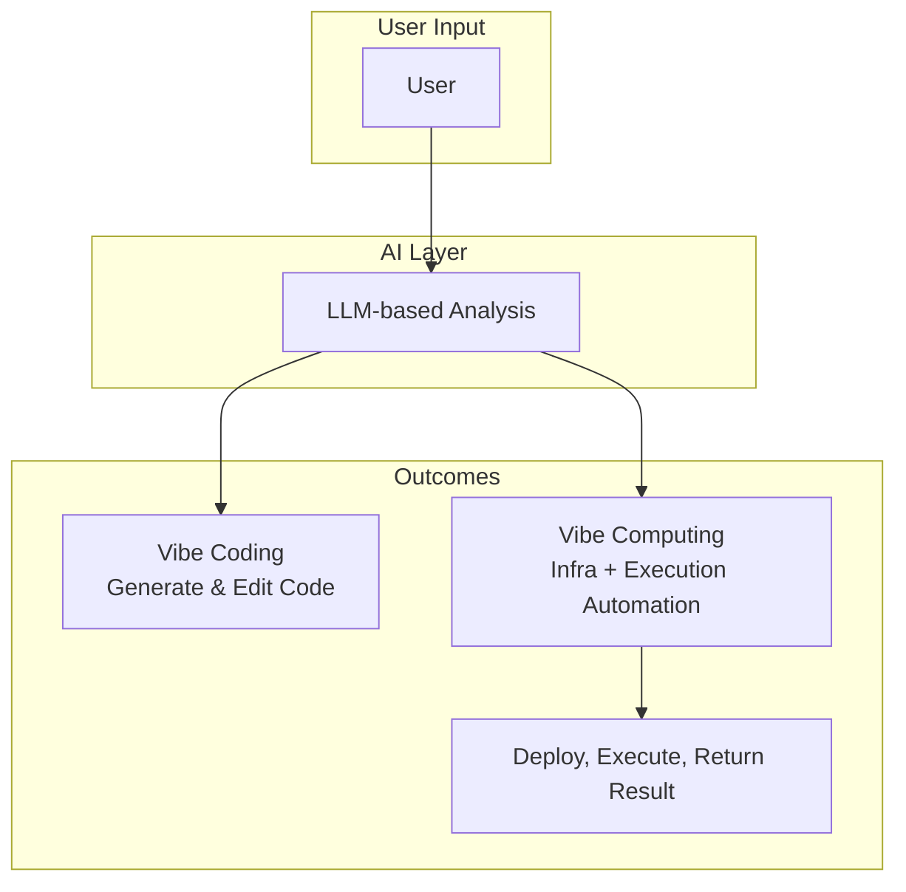

# Vibe Computing: A New Paradigm Beyond the Cloud

> “Don’t configure the cloud. Feel the vibe.”

> Concept introduced by [**Ph.D. Seokho Son**](https://www.linkedin.com/in/seokho-son/) on August 3, 2025

---

## 🌀 Overview


**Vibe Computing** is a newly proposed paradigm that succeeds traditional cloud computing. It extends the idea of computing freedom by enabling users to create and control any type of infrastructure—virtual machines, containers, serverless functions, or physical clusters—through intuitive vibes alone. It envisions a computing experience where users no longer need to understand or manage complex cloud infrastructures. Instead, users operate through **intuitive 'vibes'**, delegating the orchestration of resources and services to an intelligent and automated backend.

While **Vibe Coding** refers to the practice of prompting large language models (LLMs) to generate code via natural language, **Vibe Computing** elevates this further—automating not just coding, but the entire infrastructure lifecycle and execution pipeline based on the user’s goal. It’s a meta-computing strategy built on intent recognition and AI-driven automation. In the long term, this approach could be extended to incorporate even futuristic computing paradigms such as quantum computing or neuromorphic systems, offering users the ability to orchestrate not only today's infrastructure but also tomorrow’s breakthroughs—through vibes alone.


### Evolution of Computing Paradigms

The development of computing paradigms has expanded from centralized to distributed, and now to intent-based orchestration.
Vibe Computing emerges as a natural evolution from prior models:

* Mainframe Computing → Grid Computing → Cloud Computing → **Vibe Computing**


<div align="center">
  
</div>


---

## ☁️ Motivation & Context

### Challenges of Cloud Computing

* Although cloud computing hides infrastructure complexity, today’s multi-CSP (Cloud Service Provider) ecosystem forces users to compare, select, and manage clouds manually.

### Emergence of Multi-Cloud Management

* Multi-cloud platforms and orchestration tools try to address this complexity, yet still require users to make explicit architectural decisions.

### Enter: Vibe

* Vibe Computing proposes a new approach—**cloud-agnostic, intent-based, and fully automated**.
* It leverages LLMs, protocol interfaces, and modular platforms to create a seamless infrastructure experience.

Just as Vibe Coding allows users to build software through language, Vibe Computing allows users to **define purpose**, not process—leaving the orchestration to the system.

---

## ✨ Core Characteristics of Vibe Computing

1. **Cloud Agnostic Abstraction**

   * The user does not need to know which CSP is used. Optimal clouds are chosen dynamically.

2. **Instant Provisioning and Releasing**

   * Infrastructure is created and torn down on demand—pay-per-vibe.

3. **Goal-Aware Infrastructure Generation**

   * Based on user tasks or needs, the system selects and builds suitable infrastructure.

4. **LLM Integration via MCP (Model Context Protocol)**

   * The interface between natural language and system control, designed with token limits and context awareness in mind.

5. **Pluggable Resource Integration**

   * Any cloud, edge device, or physical resource can be added dynamically.

6. **User-Centered Experience**

   * Support for CLI, GUI, chat-based workflows—just like chatting with an assistant.

7. **Intent-Driven Autonomous Execution**

   * More than creating VMs or K8s clusters: it fulfills **complete workflows** based on purpose.
   * Can handle everything from resource allocation, setup, execution, to cleanup in one go.

---

## ✅ Example Use Cases

* **Large Number Computation**

  * The user requests: “Calculate factorial of 123456789.”
  * The system auto-selects global resources → installs/calculates → returns result → tears down resources.

* **Global Web Service Deployment**

  * User: “Deploy Nginx servers worldwide with localized welcome pages.”
  * The system creates global infrastructure, installs Nginx, deploys content in multiple languages, and serves URLs.

* **On-Demand AI Model Serving**

  * Natural language request for LLM inference deployment → GPU VM setup → model download → endpoint return → shutdown after use.

* **Personal Software Generator**

  * Ex: “Make me an app that recommends lunch using ingredients in my fridge.”
  * The system autogenerates backend/frontend, deploys, and provides a link—all in a single session.

---

## 📐 Vibe Computing vs. Vibe Coding (Mermaid Diagram)



---

## 🔧 Architecture PoC: Cloud-Barista + MCP

A prototype implementation of Vibe Computing can be achieved by integrating:

* **Cloud-Barista / CB-Tumblebug**: A multi-cloud orchestration platform for VM/K8s management.
  * https://github.com/cloud-barista/cb-tumblebug/
* **CB-Tumblebug MCP (Model Context Protocol)**: A lightweight, LLM-aware interface to mediate between user intents and backend execution.
  * https://github.com/cloud-barista/cb-tumblebug/blob/main/src/interface/mcp/README.md

With this setup, users can issue a request like:

> “Run a GPU-based LLM in the US region with 16GB VRAM and expose it via HTTPS.”

And the system will handle it end-to-end—without the user specifying cloud, image, or VM type.

---

## 🌍 Broader Implications & Expansion

* **LLM x Multi-Cloud = AI Agent Infrastructure Autonomy**
* Future integration with edge devices, home systems, IoT, and BYOD clusters
* Enables truly **ambient computing**: invisible infrastructure, visible outcomes

---

## 🧪 Proof of Concept

* Components: CB-Tumblebug + MCP Server + LLM API
* Demonstration Video: *(TBD — insert YouTube link)*

---

## 📝 Citation and Reference

If you wish to cite this concept or reference Vibe Computing in academic or technical documents, please use the following format:

**APA Style:**
Son, S. (2025). Vibe Computing: A New Paradigm Beyond the Cloud*. Retrieved from [https://github.com/seokho-son/idea/blob/main/vibe-computing.md](https://github.com/seokho-son/idea/blob/main/vibe-computing.md) (or other official source)

**BibTeX:**

```bibtex
@misc{son2025vibe,
  author       = {Seokho Son},
  title        = {Vibe Computing: A New Paradigm Beyond the Cloud},
  year         = {2025},
  note         = {Proposed concept, Cloud-Barista Initiative},
  howpublished = {\url{https://github.com/seokho-son/idea/blob/main/vibe-computing.md}}
}
```

If this document is cited in media, blogs, academic reports, or government R\&D materials, please include credit to "Ph.D. Seokho Son (ETRI)" as the concept originator.

---

## ✏️ Closing Remarks

Vibe Computing redefines computing freedom. Users can operate infrastructure without managing it, deploying services by **vibe** alone. As technology continues to evolve toward natural interfaces and intelligent agents, Vibe Computing represents a practical and scalable blueprint for the **next-generation autonomous cloud**.

> “Don’t configure the cloud. Feel the vibe.”
